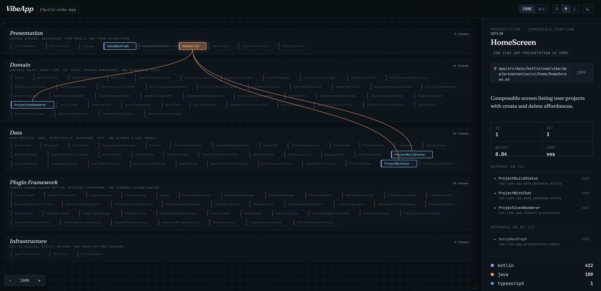

# code-map

A Claude Code plugin that builds an interactive architectural map of any project. Multi-language, tree-sitter powered, served as a local HTML page with click-through dependency navigation.

一款可为任意项目构建交互式架构图谱的 Claude Code 插件。多语言支持，基于 tree-sitter，以本地 HTML 页面呈现，支持点击跳转的依赖导航。

---

## Features / 功能简介

Scans your project, picks a fitting architectural template (Clean Architecture, MVC, Hexagonal, Frontend SPA, CLI Tool, or Pipeline), extracts core classes / structs / traits with their dependency edges, and serves a blueprint-style HTML visualization where you can click any node to see its source path, role, and dependencies.

**Supported languages:** Kotlin, Java, Python, Go, Rust, TypeScript / JavaScript.

扫描项目并自动匹配合适的架构模板（整洁架构、MVC、六边形架构、前端 SPA、CLI 工具或流水线），提取核心的类 / 结构体 / trait 及其依赖关系，并以蓝图风格的 HTML 可视化呈现——点击任意节点即可查看其源码路径、角色与依赖。

**支持语言：** Kotlin、Java、Python、Go、Rust、TypeScript / JavaScript。

---

## Screenshot / 效果截图

<p align="center">
  
  <br/>
  <em>Interactive architectural map of <a href="https://github.com/Skykai521/VibeApp">VibeApp</a> — click any node to explore its dependencies, source path, and role.</em>
  <br/>
  <em>VibeApp 的交互式架构图谱——点击任意节点即可查看其依赖、源码路径与角色。</em>
</p>

---

## Usage / 如何使用

```
/code-map:build   # extract + AI refinement → .code-map/code-map.json
/code-map:run     # start the local server and open the browser
/code-map:stop    # stop the background server
```

`build` runs the analysis, `run` opens the visualization, and `stop` shuts down the server.

`build` 执行分析，`run` 打开可视化页面，`stop` 关闭后台服务。

---

## Install / 安装

**Prerequisites:** Claude Code ≥ 2.x and Python 3.10+. The first `/code-map:build` lazily installs the tree-sitter grammars it needs — no manual `pip install`.

**前置条件：** Claude Code ≥ 2.x 与 Python 3.10+。首次执行 `/code-map:build` 时会按需自动安装所需的 tree-sitter 语法包，无需手动 `pip install`。

```text
/plugin marketplace add MollyAI/code-map
/plugin install code-map@code-map
```

To update: `/plugin marketplace update code-map`. To remove: `/plugin uninstall code-map@code-map`.

更新：`/plugin marketplace update code-map`。卸载：`/plugin uninstall code-map@code-map`。

---

## How it works / 实现原理

The work splits into three phases, each playing to its strengths:

1. **Extract** (Python + tree-sitter) — walks the project, parses each file with its language grammar, builds the dependency graph, scores importance, and picks a template from filesystem signals. Deterministic and auditable.
2. **Refine** (Claude) — verifies the template against the real code, writes one-line descriptions, fixes layer assignments, and recovers anything the parser missed. Spends tokens only where AI judgment helps.
3. **Serve** (Python stdlib HTTP) — re-reads the data on every request and serves the interactive visualization.

Design principle: **miss rather than misidentify.** Tree-sitter produces a real CST with error recovery, so anything it can't parse cleanly is deferred to Phase 2 instead of being silently guessed.

整体分为三个阶段，各司其职：

1. **提取**（Python + tree-sitter）——遍历项目，用对应语言的语法解析每个文件，构建依赖图、计算重要度，并依据文件系统信号选取模板。确定性强、可审计。
2. **精炼**（Claude）——对照真实代码校验模板，为每个声明撰写一句话说明，修正分层，并补全解析器遗漏的内容。仅在 AI 判断真正有用之处消耗 token。
3. **服务**（Python 标准库 HTTP）——每次请求都重新读取数据并提供交互式可视化。

设计原则：**宁可漏掉，不可误判。** tree-sitter 提供带错误恢复的真实 CST，凡是无法干净解析的内容都交由第 2 阶段处理，绝不静默猜测。

---

## License / 开源协议

MIT.